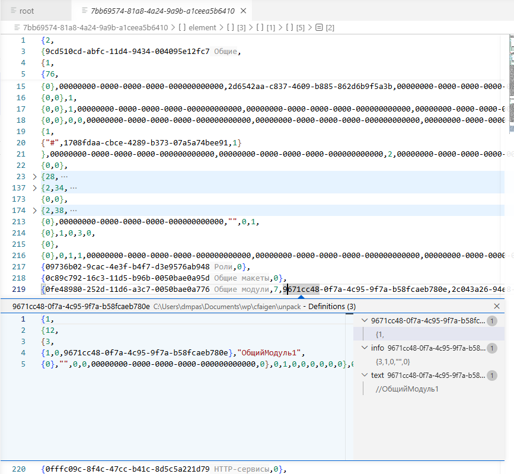

# Skobko Files Support

Расширение VS Code для работы со скобко-файлами (`.skb`).

## Возможности

- **Подсветка синтаксиса** — цветовое выделение элементов скобко-файлов
- **Навигация по документу** — breadcrumbs и outline для быстрого перемещения
- **Go to Definition** — переход к определению элемента по Ctrl+Click или F12

## Демонстрация

## Установка

1. Скачайте `.vsix` файл из релизов
2. В VS Code: Extensions → ⋯ → Install from VSIX...
3. Выберите скачанный файл

## Использование

Расширение автоматически активируется при открытии файлов с расширением `.skb`.

## Лицензия

MPL-2.0
